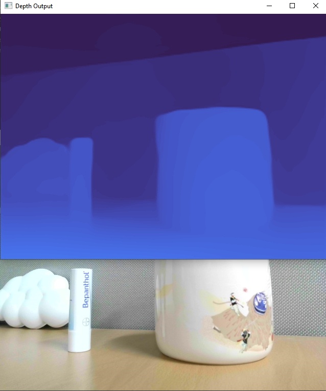
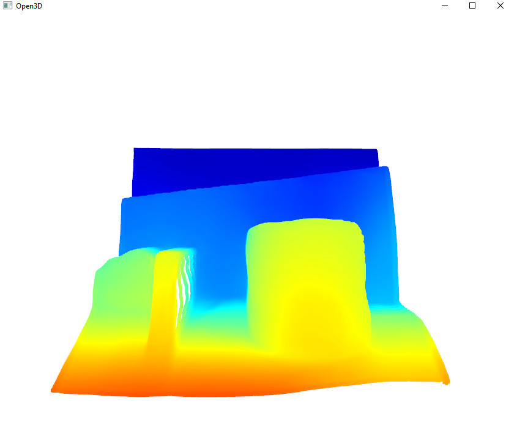

# 3D-reconstruction
Attempts to create 3D reconstruction app (web or not) for small things (not rooms)

### Creating depth map in reil-time using CPU or cuda 
(depends on what you have)
Using simple algorithm similar procedural height map generation and then terrain 
(landscape) generation, create 3D point cloud from depth map.
In future, I will add ability to create mesh from depth map which is better for many application.
 
Here is original video input and depth map for it calculated using midas library "MiDaS_small" Neural Network.
Later modifications will be added to create accurate 3D for object based on video of it (not just one frame as it does now)
 

